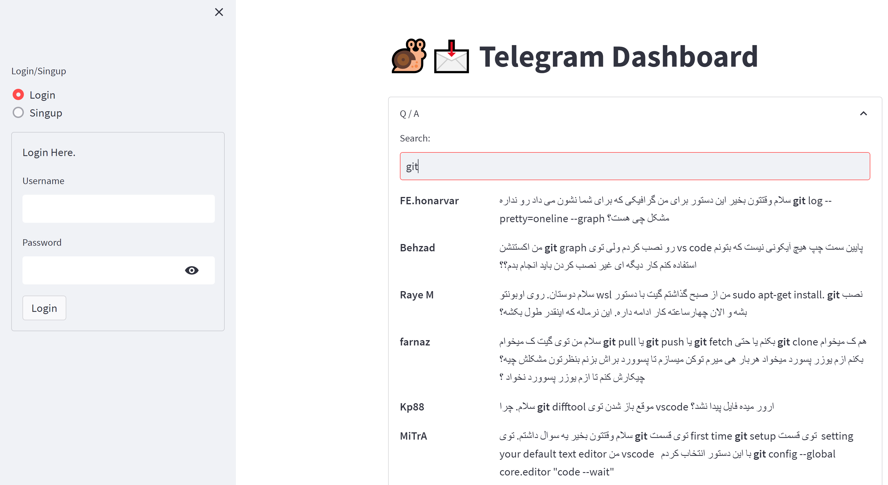

# Telegram Dashboard (powered by streamlit)

## How to Run
First, you need to install the dependencies. You can do this by running the following command:
```
pip install -r requirements.txt
```

Then, create a .env file and run the following command to start the export environment variables in main repo directory:
```
source .env
```

Run `export PYTHONPATH=${PWD}` to add the current directory to the python path.

Build django migrations by running the following command:
```
python src/manage.py makemigrations db
python src/manage.py migrate
```

Put the .json telegram chat export file in data/ folder; after that, populate telegram messages that were export from telegram (.json format) by by running the following command: 
```
python src/populate_db.py
```

Then, you can run the dashboard by running the following command:
```
streamlit run src/app.py
```


Here is the results on the downloaded telegram chat data with the given application. 


